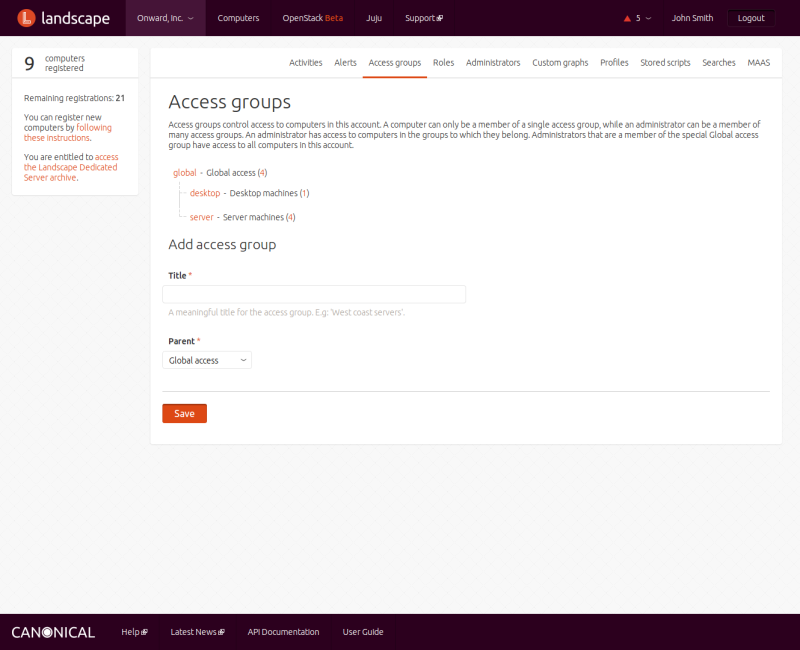
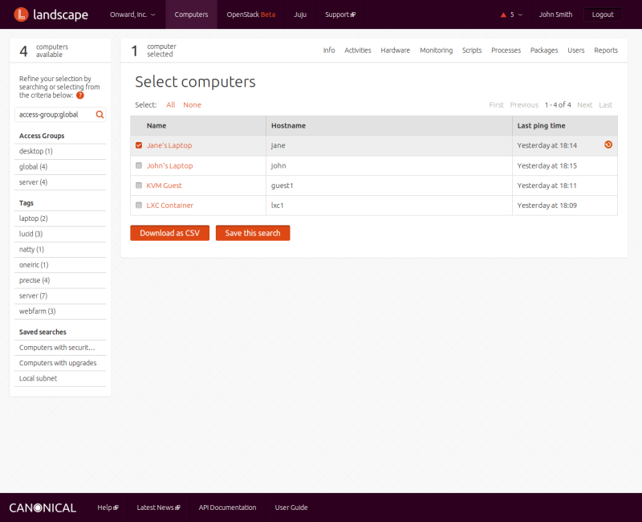
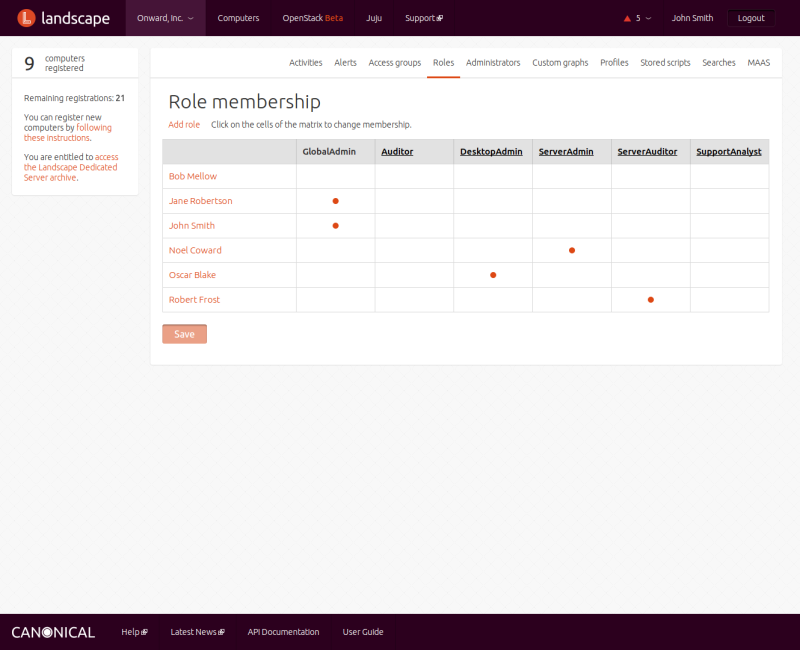
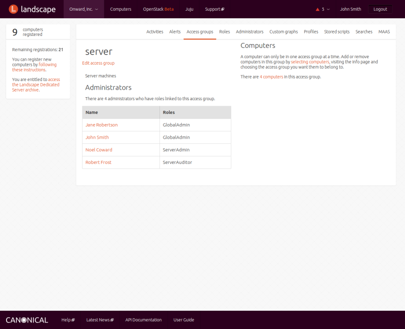
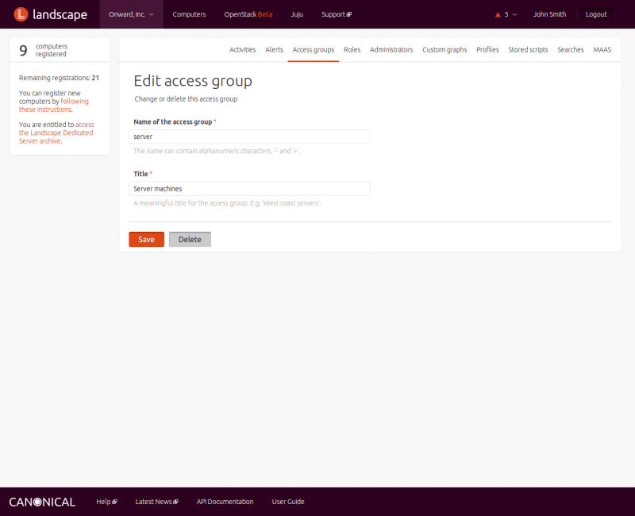

# Access groups

Landscape lets administrators limit administrative rights on computers by
assigning them to logical groupings called access groups. Each computer can be
in only one access group, but you can organize access groups hierarchically to
mirror the organization of your business. In addition to computers, access
groups can contain package profiles, scripts, and custom graphs.

## Creating access groups

A new Landscape installation comes with a single access group, called global,
which gives any administrators who are associated with roles that include that
access group control over every computer managed by Landscape. Most
organizations will want to subdivide administration responsibilities by
creating logical groupings of computers. You can create new access groups from
the ACCESS GROUPS menu under your account menu.

To create a new access group, you must provide two pieces of information: a
title for the access group and a parent.

To start with, the parent must be the global access group. If you want a flat
management hierarchy, you can make every access group a child of global.
Alternatively, you can use parent/child relationships to create a hierarchy of
access groups. For instance, you could specify different sites at a high
level, and under them individual buildings, and finally individual
departments. Such a hierarchy allows you to specify groups of computers to be
managed together by one administrator. Administrators whose roles are
associated with higher-level access groups can manage all subgroups of which
their access group is a parent.

When a new access group is first created, its administrators are those who
have roles linked to its parent access group, but you can edit the roles
associated with an access group. To change the roles associated with an access
group, see [the section on administration][admin].

## Adding computers to access groups

To see all the computers currently in an access group, click on the name of
the group in the ACCESS GROUPS screen. The screen that then appears displays
information about that group. On the right side of the screen, click the word
"computers" to show the list of computers that are currently members of this
access group.

  
Alternatively, you can click on the COMPUTERS menu item at the top of the
Landscape screen, and in the selection box at the top of the left column,
enter `access-group:` followed by the name of your access group: for instance,
`access-group:stagingservers`.

To add computers to an access group, click on the COMPUTERS menu item at the
top of the Landscape screen. The resulting INFO screen shows the total number
of available computers being managed by Landscape, and the number of computers
currently selected:

Find computers you wish to include (see the documentation on [selecting
computers][selectcomputers], then tick the checkbox next
to each computer you wish to select. Once you've made your selection, click on
the INFO menu entry at the top of the page Scroll down to the bottom section,
choose the access group you want from the drop-down list, then click Update
access group.

## Associating roles with access groups

An administrator may manage an access group if he is associated with a role
that has permission to do so. To associate a role with one or more access
groups, click on the ROLES menu item under your account to display a screen
that shows a role membership matrix.

  
The top of that screen shows a list of role names. Click on a role name to
edit the permissions and access groups associated with that role. Note that
you cannot modify the GlobalAdmin role, so there is no link associated with
that label at the top of the matrix.

## Editing access groups

To change the name or title of an existing access group, click on the name of
the group in the ACCESS GROUPS screen, then click on the Edit access group
link at the top of next screen. Make changes, then click Save.

## Deleting access groups

To delete an existing access group, click on the name of the group in the
ACCESS GROUPS screen, then click on the Edit access group link at the top of
next screen. On the resulting screen, click the Delete button. You may Confirm
the group's deletion, or you can click Cancel to abort the operation. When you
delete an access group, its resources move to its parent access group.

[selectcomputers]: ./landscape-managing-computers.md#selectingcomputers  
[admin]: ./landscape-access-groups.md#associatingadmins
