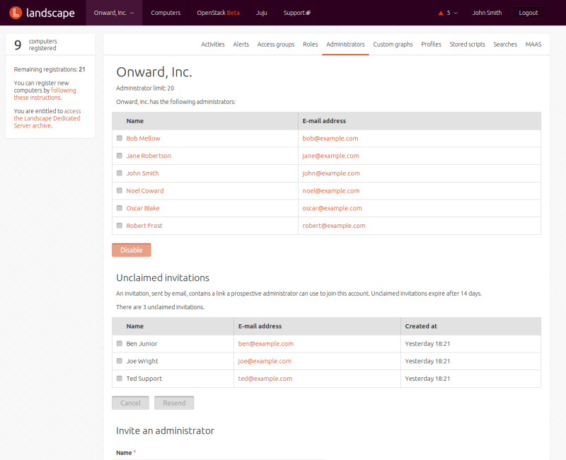

Title: Managing administrators

# Managing administrators

Administrators are people who are authorized to manage computers using
Landscape. You can manage administrators from the ADMINISTRATORS menu under
your account.

On this page, the upper part of the screen shows a list of existing
administrators and their email addresses. You may create as many as 1,000
administrators, or as few as one. If you're running Landscape Dedicated Server,
the first user you create automatically become an administrator of your
account. If you're using the hosted version of Landscape, Canonical sends you
an administrator invitation when your account is created. After that, you must
create additional administrators yourself.

## Inviting administrators

You make someone an administrator by sending that person an invitation via
email. On the administrator management page, specify the person's name and
email address, and the administration role you wish the person to have. The
choices that appear in the drop-down list are the roles defined under the ROLES
menu. See the discussion of roles below.

When you have specified contact and role information, click on the Invite
button to send an invitation. The message will go out from the email address
you specified during Landscape setup.

Users who receive an invitation will see an HTML link in the email message.
Clicking on the link takes them to a page where they are asked to log in to
Landscape or create an Ubuntu Single Sign-on account. Once they do so, they
gain the administrator privileges associated with the role to which they've
been assigned.

It's worth noting that an administrator invitation is like a blank check - the
first person who clicks on the link and submits information can become an
administrator, even if it's not the person with the name and email address to
which you sent the invitation. Therefore, take care to keep track of the status
of administrator invitations.

## Disabling administrators

To disable one or more administrators, tick the check boxes next to their
names, then click on the Disable button. The administrator is permanently
disabled and will no longer show up in Landscape. Though this operation cannot
be reversed, you can send another invitation to the same email address.

## Roles

A role is a set of permissions that determine what operations an administrator
can perform. When you define a role, you also specify a set of one or more
access groups to which the role applies.

Available permissions:

- View computers
- Manage computer
- Add computers to an access group
- Remove computers from an access group
- Manage pending computers (In the hosted version of Landscape, pending
  computers are clients that have been set up with the landscape-config tool
  but have not yet been accepted or rejected by an administrator. Landscape
  Dedicated Server never needs to have pending computers once it is set up and
  has an account password assigned.)
- View scripts
- Manage scripts
- View upgrade profiles
- Manage upgrade profiles
- View package profiles
- Manage package profiles

By specifying different permission levels and different access groups to which
they apply, you can create roles and associate them with administrators to get
a very granular level of control over sets of computers.
