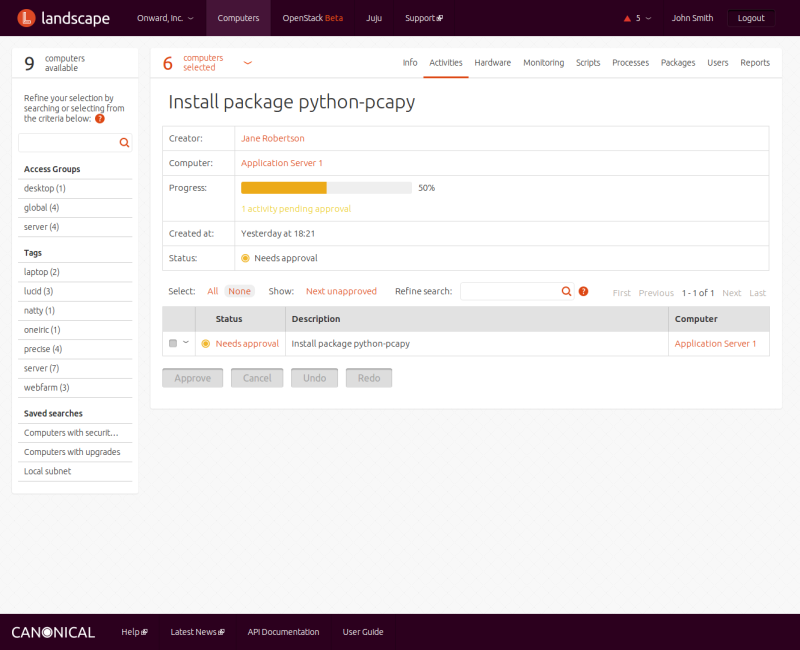
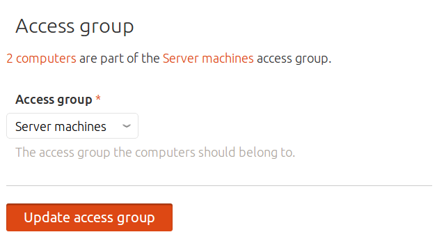
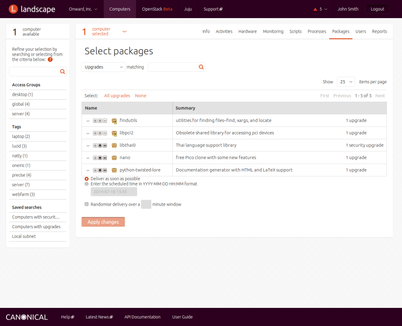
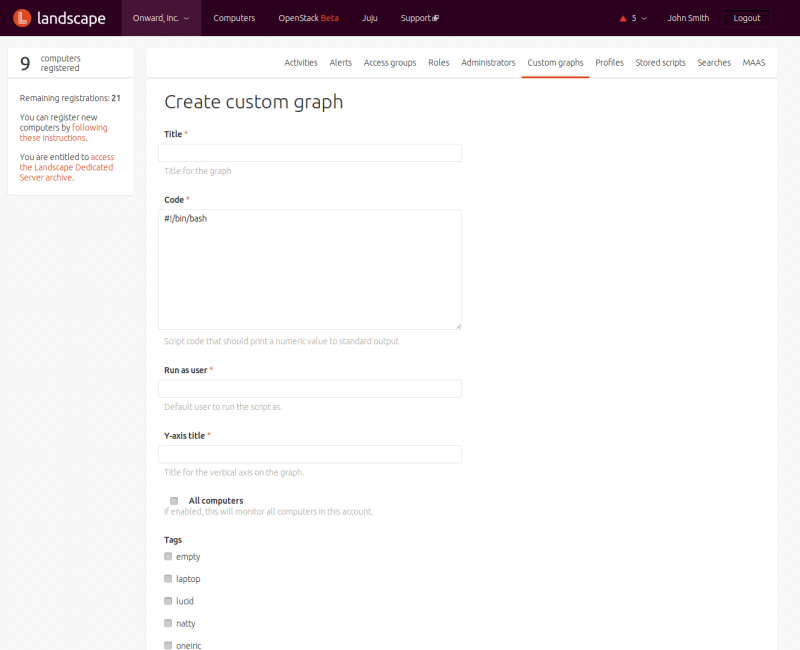

Title: Use cases

# Use cases

You can use Landscape to perform many common system administration tasks
easily and automatically. Here are a few examples...

## How do I upgrade all packages on a certain group of machines?

First, tag the machines you want to upgrade with a common tag, so you can use
the tag anytime you need to manage those computers as a group. If, for
instance, you want to upgrade all your desktop computers, you might want to
use "desktop" as a tag. Select your computers, then click on `COMPUTERS` on the
top menu, and under that `INFO`. In the box under `Tags:`, enter the tag you want
to use and click the `Add` button.

If you've already tagged the computers, click on `COMPUTERS`, then click on the
tag in the left column.

With your desktop computers selected, click on `COMPUTERS`, then `PACKAGES`.
Scroll to the bottom of the screen, where you'll see a `Request upgrades`
button. Click it to queue the upgrade tasks.



While the upgrade tasks are now in the queue, they will not be executed until
you approve them. To do so, next to `Select:`, click `All`, then click on the
`Approve` button at the bottom of the page.

### How do I keep all of my file servers automatically up to date?

The best way is to use [upgrade
profiles], which rely on access groups.

If an access group for your file servers already exists, simply click on its
name. If not, you must create an access group for them. To do so, click on
your account, then on `ACCESS GROUPS`. Specify a name for your new access group
and click the `Save` button. You must then add computers to the access group. To
do that, click on `COMPUTERS`, then select all your file servers by using a tag,
if one exists, or a search, or by ticking them individually. Once all the
computers you want to add to the access group are tagged, click on the `INFO`
menu choice, scroll down to the bottom section, choose the access group you
want from the drop-down list, then click the `Update` access group button.



Once you have all your file servers in an access group you can create an
upgrade profile for them. Click on your account, then `PROFILES` menu following
the  `Upgrade profiles` link, and then on the `Add upgrade profile` link. Enter a
name for the new upgrade profile, choose the access group you wish to
associate with it, and specify the schedule on which the upgrades should run,
then click the `Save` button.

### How do I keep Landscape from upgrading a certain package on one of my
servers?

First find the package by clicking on `COMPUTERS`, then `PACKAGES`. Use the search
box at the top of the screen to find the package you want. Click the triangle
on the left of the listing line of the package you want to hold, which expands
the information for that package. Now click on the icon to the left of the
package name. A new icon with a lock replaces the old one, indicating that
this package is to be held during upgrades. Scroll to the bottom of the page
and click on the `Apply Changes` button.



### How do I set up a custom graph?

First select the computers whose information you want to see. One good way to
do so is to create a tag for that group of computers on my computers. Suppose
you want to monitor the size of the PostgreSQL database on your database
servers. Select the servers, then click on `COMPUTERS` on the top menu, and `INFO`
under that. In the box under `Tags:`, enter a tag name, such as "db-server," and
click the `Add` button. Next, under your account, click on `CUSTOM GRAPHS`, then
on the link to `Add custom graph`. Enter a title, and in the `#!` field, enter
**/bin/sh** to indicate a shell script. In the `Code` section, enter the
commands necessary to create the data for the graph. For this example, the
command might be:

```no-highlight
psql -tAc "select pg_database_size('postgres')"
```

For Run as user, enter **postgres**.

Fill in the `Y-axis` title, then click the `Save` button at the bottom of the
page.



To view the graph, click on `COMPUTERS`, then `MONITORING`. You can select the
monitoring period from the drop-down box at the top of the window.

### How do I ensure all computers with a given tag have a common list of packages installed?

Manage them via a [package profile].


  
[upgrade profiles]: ./landscape-concepts.md#upgrade-profiles
[package profile]: ./landscape-managing-packages.md#adding-a-package-profile
